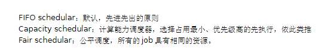
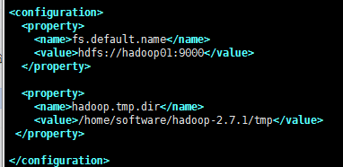
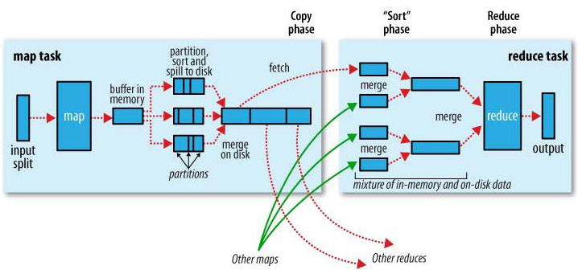
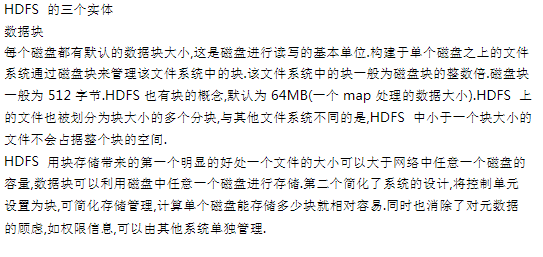
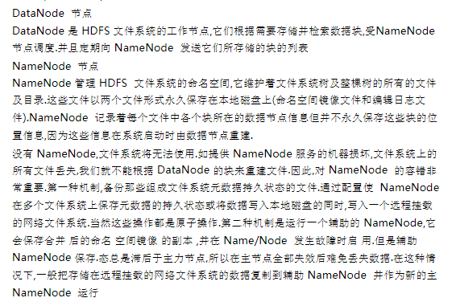
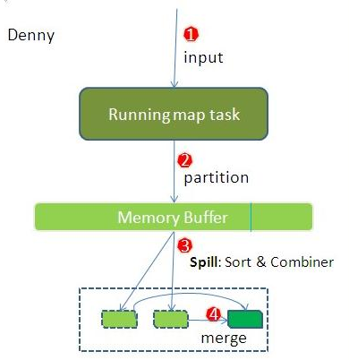
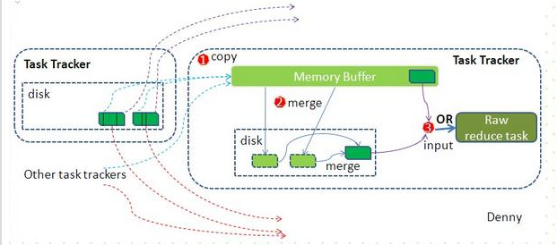
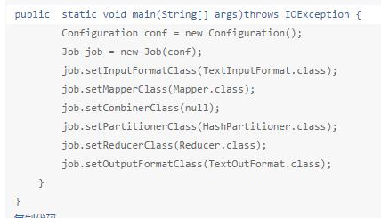
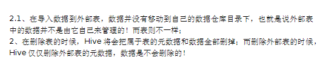

Java基础
========

Hashmap、linkedHashmap、TreeMap的区别？
---------------------------------------

Map主要用于存储健值对，根据键得到值，因此不允许键重复（重复了覆盖），但允许值重复

### Hashmap

HashMap 是一个最常用的Map，它根据键的HashCode
值存储数据，根据键可以直接获取它的值，具有很快的访问速度。遍历时，取得数据的顺序是完全随机的。  
HashMap最多只允许一条记录的键为Null；允许多条记录的值为 Null。  
HashMap不支持线程的同步（即任一时刻可以有多个线程同时写HashMap），可能会导致数据的不一致。如果需要同步，可以用
Collections的synchronizedMap方法使HashMap具有同步的能力，或者使用ConcurrentHashMap。  
　　Hashtable与
HashMap类似，它继承自Dictionary类。不同的是：它不允许记录的键或者值为空；它支持线程的同步（即任一时刻只有一个线程能写Hashtable），因此也导致了
Hashtable在写入时会比较慢

### LinkedHashMap

LinkedHashMap保存了记录的插入顺序，在用Iterator遍历LinkedHashMap时，先得到的记录肯定是先插入的。也可以在构造时带参数，按照应用次数排序。  
在遍历的时候会比HashMap慢，不过有种情况例外：当HashMap容量很大，实际数据较少时，遍历起来可能会比LinkedHashMap慢。因为LinkedHashMap的遍历速度只和实际数据有关，和容量无关，而HashMap的遍历速度和他的容量有关。

### TreeMap

TreeMap实现SortMap接口，能够把它保存的记录根据键排序。  
　　默认是按键值的升序排序，也可以指定排序的比较器，当用Iterator
遍历TreeMap时，得到的记录是排过序的。

### 三种类型的运用场景

①一般情况下，我们用的最多的是HashMap。HashMap里面存入的键值对在取出的时候是随机的，它根据键的HashCode值存储数据，根据键可以直接获取它的值，具有很快的访问速度。在Map
中插入、删除和定位元素，HashMap 是最好的选择

②TreeMap取出来的是排序后的键值对。但如果您要按自然顺序或自定义顺序遍历键，那么TreeMap会更好。

③LinkedHashMap
是HashMap的一个子类，如果需要输出的顺序和输入的相同,那么用LinkedHashMap可以实现,它还可以按读取顺序来排列，像连接池中可以应用。

抽象类和接口的理解？
--------------------

在Java中，可以通过两种形式来体现OOP(Object Oriented
Programming)的抽象：接口和抽象类

### 抽象类和普通类的区别

抽象类就是为了继承而存在的，如果你定义了一个抽象类，却不去继承它，那么等于白白创建了这个抽象类，因为你不能用它来做任何事情。对于一个父类，如果它的某个方法在父类中实现出来没有任何意义，必须根据子类的实际需求来进行不同的实现，那么就可以将这个方法声明为abstract方法，此时这个类也就成为abstract类了

①抽象方法必须为public或者protected（因为如果为private，则不能被子类继承，子类便无法实现该方法），缺省情况下默认为public。

②抽象类不能用来创建对象；

③如果一个类继承于一个抽象类，则子类必须实现父类的抽象方法。如果子类没有实现父类的抽象方法，则必须将子类也定义为为abstract类。

在其他方面，抽象类和普通的类并没有区别。

### 接口

接口是对行为的抽象

接口中可以含有 变量和方法。但是要注意，接口中的变量会被隐式地指定为public static
final变量（并且只能是public static
final变量，用private修饰会报编译错误），而方法会被隐式地指定为public
abstract方法且只能是public
abstract方法（用其他关键字，比如private、protected、static、
final等修饰会报编译错误），并且接口中所有的方法不能有具体的实现，也就是说，接口中的方法必须都是抽象方法。从这里可以隐约看出接口和抽象类的区别，接口是一种极度抽象的类型，它比抽象类更加“抽象”，并且一般情况下不在接口中定义变量。

### 接口和抽象类的区别

①语法层面上的区别

　　1）抽象类可以提供成员方法的实现细节，而接口中只能存在public abstract 方法；

　　2）抽象类中的成员变量可以是各种类型的，而接口中的成员变量只能是public static
final类型的；

　　3）接口中不能含有静态代码块以及静态方法，而抽象类可以有静态代码块和静态方法；

　　4）一个类只能继承一个抽象类，而一个类却可以实现多个接口。

②设计层面上的区别

　　1）抽象类是对一种事物的抽象，即对类抽象，而接口是对行为的抽象。抽象类是对整个类整体进行抽象，包括属性、行为，但是接口却是对类局部（行为）进行抽象。举个简单的例子，飞机和鸟是不同类的事物，但是它们都有一个共性，就是都会飞。那么在设计的时候，可以将飞机设计为一个类Airplane，将鸟设计为一个类Bird，但是不能将
飞行
这个特性也设计为类，因此它只是一个行为特性，并不是对一类事物的抽象描述。此时可以将
飞行 设计为一个接口Fly，包含方法fly(
)，然后Airplane和Bird分别根据自己的需要实现Fly这个接口。然后至于有不同种类的飞机，比如战斗机、民用飞机等直接继承Airplane即可，对于鸟也是类似的，不同种类的鸟直接继承Bird类即可。从这里可以看出，继承是一个
"是不是"的关系，而 接口 实现则是
"有没有"的关系。如果一个类继承了某个抽象类，则子类必定是抽象类的种类，而接口实现则是有没有、具备不具备的关系，比如鸟是否能飞（或者是否具备飞行这个特点），能飞行则可以实现这个接口，不能飞行就不实现这个接口。

　　2）设计层面不同，抽象类作为很多子类的父类，它是一种模板式设计。而接口是一种行为规范，它是一种辐射式设计。什么是模板式设计？最简单例子，大家都用过ppt里面的模板，如果用模板A设计了ppt
B和ppt C，ppt B和ppt
C公共的部分就是模板A了，如果它们的公共部分需要改动，则只需要改动模板A就可以了，不需要重新对ppt
B和ppt
C进行改动。而辐射式设计，比如某个电梯都装了某种报警器，一旦要更新报警器，就必须全部更新。也就是说对于抽象类，如果需要添加新的方法，可以直接在抽象类中添加具体的实现，子类可以不进行变更；而对于接口则不行，如果接口进行了变更，则所有实现这个接口的类都必须进行相应的改动。

ArrayList和LinkedList的区别？
-----------------------------

数组：优点：根据索引取值，速度极快，不会因为数据量变大，速度降低；

        缺点：数组的元素增删，效率极低（数据量越大，效率越低）

双向链表：优点：链表的元素增删效率极高（增删速度与数据量大小无关）

               缺点：根据索引取值，效率极低（数据量越大，效率越低）

多线程的使用场景
----------------

### 引入多线程的目的

1、吞吐量：你做WEB，容器帮你做了多线程，但是他只能帮你做请求层面的。简单的说，可能就是一个请求一个线程。或多个请求一个线程。如果是单线程，那同时只能处理一个用户的请求。

2、伸缩性：也就是说，你可以通过增加CPU核数来提升性能。如果是单线程，那程序执行到死也就利用了单核，肯定没办法通过增加CPU核数来提升性能。

### 应用场景

多线程最多的场景：web服务器本身；各种专用服务器（如游戏服务器）

多线程的常见应用场景：

1、后台任务，例如：定时向大量（100w以上）的用户发送邮件；

2、异步处理，例如：发微博、记录日志等；

3、分布式计算

常见的设计模式
--------------

单例模式、工厂模式、代理模式、装饰器摸式、MVC模式、组合模式

java特性
--------

封装、继承、多态、面向对象

多态的体现
----------

多态实现包括两种方式：重载和重写 。父类的引用指向子类的对象

创建线程的方式
--------------

①常用的通过继承Thread类来实现一个线程

②通过实现Runnable接口来实现一个线程

③通过实现Callable接口来实现一个线程

什么是JAVA的平台无关性？
------------------------

**C/C++程序无法跨平台的根本原因是C/C++源程序的编译器针对平台进行编译，而不同的平台有不同的机器指令，所以无法跨平台。而java有JVM**

Mysql
=====

mysql的引擎以及区别？
---------------------

Innodb引擎，Innodb引擎提供了对数据事务的支持。并且还提供了行级锁和外键的约束。它的设计的目标就是处理大数据容量的数据库系统。它本身实际上是基于Mysql后台的完整的系统。Mysql运行的时候，Innodb会在内存中建立缓冲池，用于缓冲数据和索引。但是，该引擎是不支持全文搜索的。同时，启动也比较的慢，它是不会保存表的行数的。当进行Select
count(\*) from
table指令的时候，需要进行扫描全表。所以当需要使用数据库的事务时，该引擎就是首选。由于锁的粒度小，写操作是不会锁定全表的。所以在并发度较高的场景下使用会提升效率的

MyISAM引擎，但不提供事务的支持，也不支持行级锁和外键。因此当执行Insert插入和Update更新语句时，即执行写操作的时候需要锁定这个表。所以会导致效率会降低。不过和Innodb不同的是，MyIASM引擎是保存了表的行数，于是当进行Select
count(\*) from
table语句时，可以直接的读取已经保存的值而不需要进行扫描全表。所以，如果表的读操作远远多于写操作时，并且不需要事务的支持的。可以将MyIASM作为数据库引擎的首先

### 使用场景

①大容量的数据集时趋向于选择Innodb。因为它支持事务处理和故障的恢复。Innodb可以利用数据日志来进行数据的恢复。主键的查询在Innodb也是比较快的。

②大批量的插入语句时（这里是INSERT语句）在MyIASM引擎中执行的比较的快，但是UPDATE语句在Innodb下执行的会比较的快，尤其是在并发量大的时候。

### 两种引擎所使用的索引的数据结构是什么？

答案:都是B+树

MyIASM引擎，B+树的数据结构中存储的内容实际上是实际数据的地址值。也就是说它的索引和实际数据是分开的，只不过使用索引指向了实际数据。这种索引的模式被称为非聚集索引

Innodb引擎的索引的数据结构也是B+树，只不过数据结构中存储的都是实际的数据，这种索引有被称为聚集索引

查看数据库正在使用的引擎：show variables like ‘storage_engine’;

查看有哪些引擎：show engines;

1.  inner join 和left join的区别

①inner join(内连接)：取得两个表中存在连接匹配关系的记录

②left join (左连接)：以左表为基准(取左表所有记录)，右表匹配向左表

2.数据库三范式(范式即规范)
--------------------------

第一范式：每一列属性都是不可再分的属性值，确保每一列的原子性。两列的属性相近或相似或一样，尽量合并属性一样的列，确保不产生冗余数据。

第二范式：要求数据库当中的每一行必须可以被唯一的区分，加一列设成主键。另外非主键的列要依赖主键,最好第二范式要让每个表只描述一件事情

第三范式：要求一个数据库中非主键列不依赖于其他非主键列

### mysql的类似merge into操作？

merge你能够在一个SQL语句中对一个表同时执行inserts和updates操作

mysql并不没有oracle、mssql的merge into语法，但是有个on duplicate key
update语法（不是标准的sql语法）可以实现merge into语法

 \#insert into dup(id,name,phone ) select \* from dupnew on duplicate key update
name=values(name);

WEB和框架
=========

spring的特性
------------

IOC DI 和 AOP

MVC是什么？
-----------

MVC 是一种使用 MVC（Model View Controller 模型-视图-控制器）设计创建 Web
应用程序的模式： [1] 

**Model（模型）**是应用程序中用于处理应用程序数据逻辑的部分。通常模型对象负责在数据库中存取数据。

**View（视图）**是应用程序中处理数据显示的部分。通常视图是依据模型数据创建的。

**Controller（控制器）**是应用程序中处理用户交互的部分。通常控制器负责从视图读取数据，控制用户输入，并向模型发送数据。

MVC
分层有助于管理复杂的应用程序，因为您可以在一个时间内专门关注一个方面。例如，您可以在不依赖业务逻辑的情况下专注于视图设计。同时也让应用程序的测试更加容易。

MVC
分层同时也简化了分组开发。不同的开发人员可同时开发视图、控制器逻辑和业务逻辑。

框架和设计模式以及架构的区别？
------------------------------

框架通常是代码重用，而设计模式是设计重用，架构则介于两者之间，部分代码重用，部分设计重用，有时分析也可重用。

设计模式是对在某种环境中反复出现的问题以及解决该问题的方案的描述，它比框架更抽象。一个框架中往往含有一个或多个设计模式，框架总是针对某一特定应用领域，但同一模式却可适用于各种应用

Redis
=====

### redis的数据类型？五种

String：字符串类型

Hash：具有对象结构的value类型（key-value类型）

List：链表集合，有头有尾有中间，通过下标操作键值对（可以有重复值）

Set：无序集合

Zset：有序集合

### redis中set和list的区别？

在Redis中，list选取的是链表，原因：因为在redis操作中，更多的操作是进行元素的增删。

set类型看做无序的字符集合，和list不同的是，set中不允许出现重复的元素。

### redis的管道操作？

Redis服务是一种C/S模型，提供请求－响应式协议的TCP服务，所以当客户端请求发出，服务端处理并返回结果到客户端，一般是以阻塞形式等待服务端的响应，但这在批量处理连接时延迟问题比较严重，所以Redis为了提升或弥补这个问题，引入了管道技术：可以做到服务端未及时响应的时候，客户端也可以继续发送命令请求，做到客户端和服务端互不干涉影响，服务端并最终返回所有服务端的响应，这在促进原有C/S模型交互的响应速度上有了质的提高。

在构建批量命令集或是组装属性字符串时，命令间使用\\r\\n进行分离即可

Linux
=====

### 如何查看磁盘分区？

df命令----列出文件系统整体磁盘使用情况

### 如何创建多级目录？

\#mkdir -p

大数据技术
==========

Hadoop
------

### HDFS中的block默认存几份？

默认3副本机制

### 那个程序通常与NameNode在一个节点启动？

答案：Jobtracker

hadoop的集群是基于master/slave模式，namenode和jobtracker属于master，datanode和tasktracker属于slave，master只有一个，而slave有多个  
  
JobTracker  对应于 NameNode  
TaskTracker 对应于 DataNode  
DataNode 和NameNode 是针对数据存放来而言的  
JobTracker和TaskTracker是对于MapReduce执行而言的  
  
mapreduce中几个主要概念，mapreduce整体上可以分为这么几条执行线索：  
jobclient，JobTracker与TaskTracker。

①JobClient会在用户端通过JobClient类将应用已经配置参数打包成jar文件存储到hdfs，并把路径提交到Jobtracker,然后由JobTracker创建每一个Task（即MapTask和ReduceTask）并将它们分发到各个TaskTracker服务中去执行

②JobTracker是一个master服务，软件启动之后JobTracker接收Job，负责调度Job的每一个子任务task运行于TaskTracker上，并监控它们，如果发现有失败的task就重新运行它。一般情况应该把JobTracker部署在单独的机器上。

③TaskTracker是运行在多个节点上的slaver服务。TaskTracker主动与JobTracker通信，接收作业，并负责直接执行每一个任务。TaskTracker都需要运行在HDFS的DataNode上

### HDFS默认Block size的大小？

128MB

### 集群主要瓶颈？

当我们面临集群作战的时候，我们所希望的是即读即得。可是面对大数据，读取数据需要经过IO，这里可以把IO理解为水的管道。管道越大越强，我们对于T级的数据读取就越快。所以IO的好坏，直接影响了集群对于数据的处理。

网络是一种稀缺资源，而不是瓶颈

在云服务器中看到的硬盘叫磁盘[虚拟出来的硬盘]，在集群中的物理硬盘叫硬盘）

### Hadoop的调度器？

### Hadoop的核心配置文件？core-site. xml

fs.default.name----指明namenode在那台服务器上

hadoop.tmp.dir----指明hadoop元数据存储的目录

### MapReduce的工作原理？

**map task**

程序会根据InputFormat将输入文件分割成splits，每个split会作为一个map
task的输入，每个map task会有一个内存缓冲区，

输入数据经过map阶段处理后的中间结果会写入内存缓冲区，并且决定数据写入到哪个partitioner，当写入的数据到达内存缓冲

区的的阀值(默认是0.8)，会启动一个线程将内存中的数据溢写入磁盘，同时不影响map中间结果继续写入缓冲区。在溢写过程中，

MapReduce框架会对key进行排序，如果中间结果比较大，会形成多个溢写文件，最后的缓冲区数据也会全部溢写入磁盘形成一个溢写

文件(最少有一个溢写文件)，如果是多个溢写文件，则最后合并所有的溢写文件为一个文件。

**reduce task**

当所有的map task完成后，每个map
task会形成一个最终文件，并且该文件按区划分。reduce任务启动之前，一个map
task完成后，

就会启动线程来拉取map结果数据到相应的reduce
task，不断地合并数据，为reduce的数据输入做准备，当所有的map tesk完成后，

数据也拉取合并完毕后，reduce task 启动，最终将输出输出结果存入HDFS上。

### Hdfs存储的机制？

### MapReduce是怎样运行起来的？

(1) 开发人员编写好MapReduce program，将程序打包运行。

(2) JobClient向JobTracker申请可用Job，JobTracker返回JobClient一个可用Job ID。

(3) JobClient得到Job ID后，将运行Job所需要的资源拷贝到共享文件系统HDFS中。

(4) 资源准备完备后，JobClient向JobTracker提交Job。

(5) JobTracker收到提交的Job后，初始化Job。

(6)
初始化完成后，JobTracker从HDFS中获取输入splits(作业可以该启动多少Mapper任务)。

(7) 与此同时，TaskTracker不断地向JobTracker汇报心跳信息，并且返回要执行的任务。

(8) TaskTracker得到JobTracker分配(尽量满足数据本地化)的任务后，向HDFS获取Job资源(若数据是本地的，不需拷贝数据)。

(9) 获取资源后，TaskTracker会开启JVM子进程运行任务。

资源指的是：

①程序jar包、作业配置文件xml

 ②输入划分信息，决定作业该启动多少个map任务

 ③本地文件，包含依赖的第三方jar包(-libjars)、依赖的归档文件(-archives)和普通文件(-files)，如果已经上传，则不需上传

### hdfs如何使用命令进行重新平衡？

HDFS的数据在各个DataNode中的分布可能很不均匀，尤其是在DataNode节点出现故障或新增DataNode节点时。新增数据块时NameNode对DataNode节点的选择策略也有可能导致数据块分布不均匀。用户可以使用命令重新平衡DataNode上的数据块的分布：

hadoop2.7.1的sbin目录下：\#./start-balancer.sh

### MapReduce中的shuffle过程

Shuffle的过程：描述数据从map task输出到reduce task输入的这段过程。

我们对Shuffle过程的期望是：

★ 完整地从map task端拉取数据到reduce task端 

★ 跨界点拉取数据时，尽量减少对带宽的不必要消耗

★ 减小磁盘IO对task执行的影响

先看map端：

split被送入map
task后，程序库决定数据结果数据属于哪个partitioner，写入到内存缓冲区，到达阀值，开启溢写过程，进行key排序，

如果有combiner步骤，则会对相同的key做归并处理，最终多个溢写文件合并为一个文件。

 

再看reduce端：

多个map task形成的最终文件的对应partitioner会被对应的reduce
task拉取至内存缓冲区，对可能形成多个溢写文件合并，最终

作为resuce task的数据输入 。

### MapReduce编程的主要组件

InputFormat类：分割成多个splits和每行怎么解析。   

Mapper类：对输入的每对\<key,value\>生成中间结果。

Combiner类：在map端，对相同的key进行合并。

Partitioner类：在shuffle过程中，将按照key值将中间结果分为R份，每一份都由一个reduce去完成。

Reducer类：对所有的map中间结果，进行合并。

OutputFormat类：负责输出结果格式

### 针对MapReduce的缺点，Yarn（MR2.0）解决了什么?

Yet Another Resource Negotiator，另一种资源协调者

MapReduce由以下缺点：

★ JobTracker挂掉，整个作业挂掉，存在单点故障

★ JobTracker既负责资源管理又负责作业控制，当作业增多时，JobTracker内存是扩展的瓶颈

★ map task全部完成后才能执行reduce task，造成资源空闲浪费

YARN设计考虑以上缺点，对MapReduce重新设计：

★ 将JobTracker职责分离，ResouceManager全局资源管理，ApplicationMaster管理作业的调度

★ 对ResouceManager做了HA设计

★ 设计了更细粒度的抽象资源容器Container

### hadoop的列式存储

列式存储和行式存储相比有哪些优势？

①可以跳过不符合条件的记录，降低IO次数

②压缩编码可以降低磁盘存储空间，由于同一列的数据类型都是一样的，可以使用更高效的压缩编码进一步节约存储空间

③列式存储只需要读取需要的列，支持向量运算，能够获取更好的扫描性能

Hive重点
--------

1.  hive中的所有查询除了"select \* from table;"都是需要通过Map\\Reduce的方式来执行的。

2.  hive和mysql的区别？

①Hive使用类SQL的查询语言HQL。熟悉SQL开发的开发者可以很方便的使用Hive进行开发

②Hive 是建立在 Hadoop 之上的，所有 Hive 的数据都是存储在 HDFS 中的。而数据库则可以将数据保存在块设备或者本地文件系统中。

③Hive 中没有定义专门的数据格式，数据格式可以由用户指定，用户定义数据格式需要指定三个属性：列分隔符（通常为空格、”\\t”、”\\x001″）、行分隔符（”\\n”）以及读取文件数据的方法（Hive 中默认有三个文件格式TextFile，SequenceFile以及RCFile）。由于在加载数据的过程中，不需要从用户数据格式到 Hive 定义的数据格式的转换，因此，Hive在加载的过程中不会对数据本身进行任何修改，而只是将数据内容复制或者移动到相应的HDFS目录中。而在数据库中，不同的数据库有不同的存储引擎，定义了自己的数据格式。所有数据都会按照一定的组织存储，因此，数据库加载数据的过程会比较耗时

④由于Hive是针对数据仓库应用设计的，而数据仓库的内容是读多写少的。因此，Hive中不支持对数据的改写和添加，所有的数据都是在加载的时候中确定好的。而数据库中的数据通常是需要经常进行修改的，因此可以使用 INSERT INTO …  VALUES 添加数据，使用 UPDATE … SET修改数据。

⑤Hive在加载数据的过程中不会对数据进行任何处理，甚至不会对数据进行扫描，因此也没有对数据中的某些Key建立索引。Hive要访问数据中满足条件的特定值时，需要暴力扫描整个数据，因此访问延迟较高。由于 MapReduce 的引入， Hive 可以并行访问数据，因此即使没有索引，对于大数据量的访问，Hive 仍然可以体现出优势。数据库中，通常会针对一个或者几个列建立索引，因此对于少量的特定条件的数据的访问，数据库可以有很高的效率，较低的延迟。由于数据的访问延迟较高，决定了 Hive 不适合在线数据查询。

⑥Hive中大多数查询的执行是通过 Hadoop 提供的 MapReduce 来实现的（类似 select \* from tbl的查询不需要MapReduce）。而数据库通常有自己的执行引擎。

⑦由于Hive是建立在Hadoop之上的，因此Hive的可扩展性是和Hadoop的可扩展性是一致的（世界上最大的Hadoop 集群在 Yahoo!，2009年的规模在4000 台节点左右）。而数据库由于 ACID 语义的严格限制，扩展行非常有限。目前最先进的并行数据库 Oracle 在理论上的扩展能力也只有100台左右。

### hive引入数据的方式？

①insert into 表名 values();

②添加指定文件到指定表 load data local path 路径 into table 表名;

③从一张表查询出来的数据插入到另一张表中

\#inset overwrite table 表名1 select \* from 表名2;

### hive引入分桶表的目的？

分桶的原理是根据指定的列的计算hash值模余分桶数量后将数据分开存放。方便数据抽样

对于分桶表，不允许以外部文件方式导入数据，只能从另外一张表数据导入

### Hive内部表和外部表的区别？

### hive如何创建分区表？

方式一：创建内部分区表

\#create table book(id int,name string) partitioned by (category string) row
format delimited fields terminated by '\\t';

将本地系统文件中的数据插入到cn分区中

\#load data local inpath 文件路径 overwrite into table 表名 partition
(category=’cn’)

方式二：创建内部分区表，然后在HDFS上创建分区目录，上传文件到该分区目录下。然后手动添加分区

\#alter table 表名 partition(分区字段) location ‘hdfs上的文件路径’

方式三： 创建一个内部分区表，然后在HDFS上创建分区目录，并上传文件到该分区目录

使用命令\#msck repair table book; //自动添加该表下的分区目录

### hive的文件格式？

**textfile：文本文件**

>   Hive默认格式，数据不做压缩，磁盘开销大，数据解析开销大。   
>   可结合Gzip、Bzip2、Snappy等使用（系统自己主动检查，执行查询时自己主动解压），但使用这样的方式。hive不会对数据进行切分。从而无法对数据进行并行操作。

**Sequencefile：二进制文件**

>   SequenceFile是Hadoop API
>   提供的一种二进制文件，它将数据(key,value)的形式序列化到文件里。   
>   这样的二进制文件内部使用Hadoop 的标准的Writable
>   接口实现序列化和反序列化。它与Hadoop API中的MapFile 是互相兼容的。   
>   Hive 中的SequenceFile 继承自Hadoop API
>   的SequenceFile，只是它的key为空。使用value 存放实际的值。 这样是为了避免MR
>   在执行map 阶段的排序过程。

**Rcfile：**

>   RCFile是Hive推出的一种专门面向列的数据格式。

>   它遵循“先按列划分。再垂直划分”的设计理念。

>   当查询过程中，针对它并不关心的列时，它会在IO上跳过这些列。须要说明的是。RCFile在map阶段从远端拷贝仍然是拷贝整个数据块，而且复制到本地文件夹后，**RCFile并非真正直接跳过不须要的列，并跳到须要读取的列，
>   而是通过扫描每个row group的头部定义来实现的。**   
>   可是在整个HDFS Block 级别的头部并未定义每个列从哪个row group起始到哪个row
>   group结束。所以在读取全部列的情况下。RCFile的性能反而没有SequenceFile高。

### hive调优

Kafka重点
---------

### kafka分区？

分区是物理上的概念，每一个topic包含一个或多个partition。

①为了使得Kafka的吞吐率可以线性提高，物理上把Topic分成一个或多个Partition，每个Partition在物理上对应一个文件夹，该文件夹下存储这个Partition的所有消息和索引文件。

②因为每条消息都被append到该Partition中，属于顺序写磁盘，因此效率非常高（经验证，顺序写磁盘效率比随机写内存还要高，这是Kafka高吞吐率的一个很重要的保证）

③对于传统的message
queue而言，一般会删除已经被消费的消息，而Kafka集群会保留所有的消息，无论其被消费与否。当然，因为磁盘限制，不可能永久保留所有数据（实际上也没必要），因此Kafka提供两种策略删除旧数据。一是基于时间，二是基于Partition文件大小。

### Kafka的java接口？

// 创建一个单分区单副本名为t1的topic

//--①参：*zk*连接参数 ②参:主题名 ③参:分区数 ④参:副本数

AdminUtils.*createTopic*(zkUtils, "t2",3,2, **new** Properties(),
RackAwareMode.Enforced\$.*MODULE\$*);

// 删除topic 't1'

AdminUtils.*deleteTopic*(zkUtils, "t2");

//--指定消费者消费的主题，可以指定多个

consumer.subscribe(Arrays.*asList*("enbook", "t2"));

### Kafka如何保证消息不丢？

kafka消息丢失的情况：

1）使用同步模式的时候，有3种状态保证消息被安全生产，在配置为1（只保证写入leader成功）的话，如果刚好leader
partition挂了，数据就会丢失。

2）还有一种情况可能会丢失消息，就是使用异步模式的时候，当缓冲区满了，如果配置为0（还没有收到确认的情况下，缓冲池一满，就清空缓冲池里的消息），

数据就会被立即丢弃掉。

\---------------------

只要能避免上述两种情况，那么就可以保证消息不会被丢失。

1）就是说在同步模式的时候，确认机制设置为-1，也就是让消息写入leader和所有的副本。

2）还有，在异步模式下，如果消息发出去了，但还没有收到确认的时候，缓冲池满了，在配置文件中设置成不限制阻塞超时的时间，也就说让生产端一直阻塞，这样也能保证数据不会丢失。

在数据消费时，避免数据丢失的方法：如果使用了storm，要开启storm的ackfail机制；如果没有使用storm，确认数据被完成处理之后，再更新offset值。低级API中需要手动控制offset值。

### Kafka如何保证消息不被重复消费？

（1）去重：将消息的唯一标识保存到外部介质中，每次消费处理时判断是否处理过；  
（2）不管：大数据场景中，报表系统或者日志信息丢失几条都无所谓，不会影响最终的统计分析结

zookeeper
---------

### zookeeper的选举id的配置文件？

zookeeper自定义的存储数据文件的目录下的myid文件

### zookeeper的核心配置文件？

zoo.cfg

Python
------

爬虫类库：urllib、urllib2、cookielib
